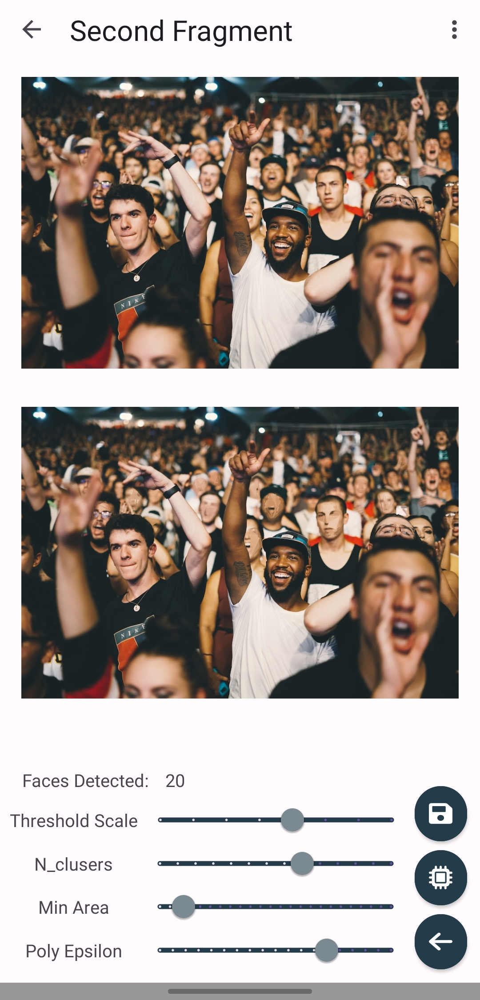

# Scalable Aesthetic-Preserving Face De-Identification

<b><i>Tech Stack</i></b>

 

   
## Build Instructions
### 1.  OpenCV 
Need to set up OpenCV yourself, here are the instructions [link](https://philipplies.medium.com/setting-up-latest-opencv-for-android-studio-and-kotlin-2021-edition-259be404b133)
          
### 2.  Android Compile 
You can use the standard Android studio build methods to run the application on a phone or the emulator. Instructions can be found [here](https://developer.android.com/studio/run).

## App Description:

### 1.  App UI

 
<caption><i>Image Process Screen</i></caption>

### 2. Compilation demo of our application
Watch the video [link](https://drive.google.com/file/d/1YOQFlHQubktzrKQH43BQKHww-Pqae8wl/view?usp=sharing)
